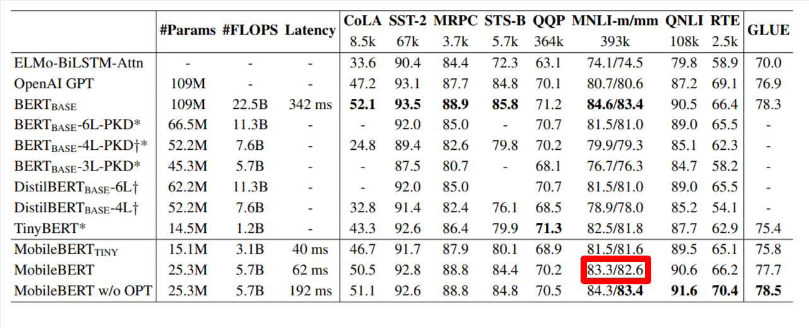
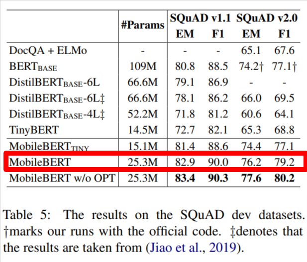

# MobileBert_paddle
这是一个mobileBert的基于paddle深度学习框架的复现

MobileBERT: a Compact Task-Agnostic BERT for Resource-Limited Devices.
[https://arxiv.org/pdf/1907.11692.pdf]

原论文效果



## 快速开始
环境要求:

paddlepaddle==2.1.2\
pytorch==1.7.1\
numpy>=1.7\
paddlenlp==2.0.7\
visualdl==2.2.0\
transformers==4.9.2\

```python
#克隆本仓库
git clone https://github.com/nosaydomore/MobileBert_paddle.git
#进入项目目录
cd MobileBert_paddle
```

### 1. 模型转换
```python
python convert.py
'''
transpose paramter of key:mobilebert.embeddings.embedding_transformation.weight
transpose paramter of key:mobilebert.encoder.layer.0.attention.self.query.weight
transpose paramter of key:mobilebert.encoder.layer.0.attention.self.key.weight
...
...
...
...
transpose paramter of key:mobilebert.encoder.layer.23.ffn.2.output.dense.weight
transpose parameter 361
finnish convert pytorch to paddle.
model_saved: ./weight/paddle/model_state.pdparams
'''

```

### 2. 模型精度对齐

```python
python compare.py
'''
sent_feat_pd: [1, 11, 512]
sent_feat_pt: torch.Size([1, 11, 512])
cls_feat_pd: [512]
cls_feat_pt: torch.Size([512])

cls token feat:
diff_mean: tensor(1.7400)
diff_max: tensor(12.)

other token feat:
diff_mean: tensor(2.8562e-06)
diff_max: tensor(3.0518e-05)
'''
```
复现到这一步，发现cls token的feat误差较大，主要原因是数值较大导致，只比较数值的话差异还可以。


```
@inproceedings{2020MobileBERT,
  title={MobileBERT: a Compact Task-Agnostic BERT for Resource-Limited Devices},
  author={ Sun, Z.  and  Yu, H.  and  Song, X.  and  Liu, R.  and  Yang, Y.  and  Zhou, D. },
  booktitle={Proceedings of the 58th Annual Meeting of the Association for Computational Linguistics},
  year={2020},
}
```