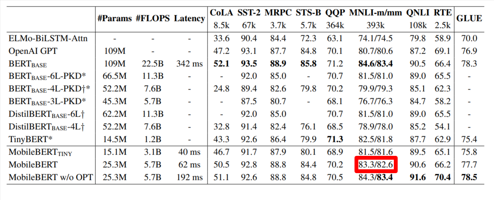
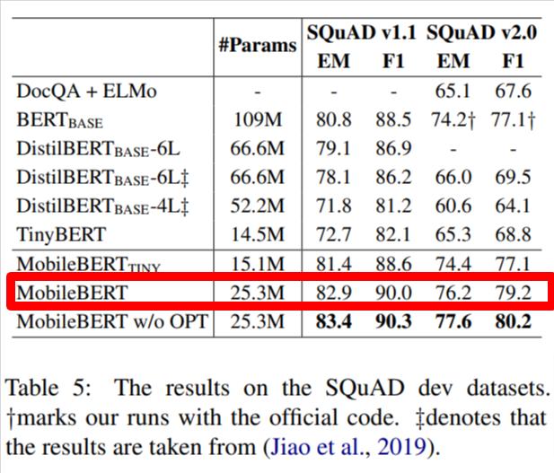

# MobileBert_paddle

# 一、简介
本项目基于paddlepaddle框架复现MobileBert，MobileBert是一种轻量化的NLP网络模型，MobileBert作为一种基于tranformer的模型在保证模型参数少的同时，其模型性能优于同类型参数量远超它的Bert模型。其次，该模型提出了一种迁移学习算法，该算法可以有效的提升小模型的精度。

论文:

MobileBERT: a Compact Task-Agnostic BERT for Resource-Limited Devices.
[https://arxiv.org/pdf/2004.02984.pdf]

## 项目aistudio地址：
notebook任务: [https://aistudio.baidu.com/aistudio/projectdetail/2367246](https://aistudio.baidu.com/aistudio/projectdetail/2367246)

# 二、复现精度
模型在SQuADV1,SQuADV2,MNLI上进行训练微调
与论文中report的结果对比如下

| 数据集  | 原论文           | 复现结果          |
| ------- | ---------------- | ----------------- |
| SQuADV1 | 82.9/90.0(em/f1) | 83.0842 / 90.1204 |
| SQuADV2 | 76.2/79.2(em/f1) | 76.6192/79.7484   |
| MNLI    | 83.3/82.6(m/mm)  | 0.83423/0.83563   |

原论文效果



# 四、环境依赖

- 硬件

  GPU: Nvidia Tesla V100 32G

- 框架

  paddlepaddle==2.1.2

  paddlenlp==2.0.7

  python==3.7

  numpy>=1.7
  visualdl==2.2.0

  

  pytorch==1.7.1（模型对齐校验）

  transformers==4.9.2 （模型对齐校验）

# 快速开始


```python
#克隆本仓库
git clone https://github.com/nosaydomore/MobileBert_paddle.git
#进入项目目录
cd MobileBert_paddle
```

复现环境使用的是baidu的AIStudio至尊版（V100 32G）

AIStudio项目地址：https://aistudio.baidu.com/aistudio/projectdetail/2367246 , AiStudio运行更方便. 强烈建议在AIStudio的终端上进行结果复现(版本选择：MobileBert_PaddleV3)。

## 1. 模型转换

提供下载好的pytorch权重以及转换完成的paddle权重

将链接中weight里的文件放在项目中weight的目录下即可

链接: https://pan.baidu.com/s/1o35WuWIUPNWQYyc43dj_pQ 提取码: 92fk

```python
python convert.py
'''
transpose paramter of key:mobilebert.embeddings.embedding_transformation.weight
transpose paramter of key:mobilebert.encoder.layer.0.attention.self.query.weight
transpose paramter of key:mobilebert.encoder.layer.0.attention.self.key.weight
...
...
...
...
transpose paramter of key:mobilebert.encoder.layer.23.ffn.2.output.dense.weight
transpose parameter 361
finnish convert pytorch to paddle.
model_saved: ./weight/paddle/model_state.pdparams
'''

```

## 2. 模型精度对齐

```python
python compare.py
'''
sent_feat_pd: [1, 11, 512]
sent_feat_pt: torch.Size([1, 11, 512])
cls_feat_pd: [512]
cls_feat_pt: torch.Size([512])

cls token feat:
diff_mean: tensor(1.7400)
diff_max: tensor(12.)

other token feat:
diff_mean: tensor(2.8562e-06)
diff_max: tensor(3.0518e-05)
'''
```
复现到这一步，发现cls token的feat误差较大，主要原因是数值较大导致，只比较数值的话差异还可以。
此外比较了其他 token的误差，在可接受的范围内。
分析原因：
可能是模型为了减少延迟，使用`no_norm`替代了`layer_norm`,使得各个token之间在数值量级上少了约束，导致`cls`与其他差异较大，这里认为模型前向对齐了

此外在复现过程中paddlenlp的tokenizer与hugginface没有对齐，这里也做了对齐，运行`python compare_tokenizer.py`

## 3. 模型训练与评估


### 评估

提供已经训练好的模型权重，以供评估（模型训练过程中的log也保存在里面）

链接: https://pan.baidu.com/s/1Uga9Wwx9cN8CdqD5G4-bFQ 提取码: jftn 

将链接中task文件夹下的文件放在项目的task目录下（直接覆盖）

在SQuADV1上评估:`bash scripts/eval_squadv1.sh`

```
{
    "exact": 83.08420056764427,
    "f1": 90.12042552144304,
    "total": 10570
    "HasAns_exact": 83.08420056764427
    "HasAns_f1": 90.12042552144304
    "HasAns_total": 10570
}
```

在SQuADV2上评估:`bash scripts/eval_squadv2.sh`

```
10320/12354
{
  "exact": 76.61922007917123,
  "f1": 79.74841781219972,
  "total": 11873,
  "HasAns_exact": 71.54183535762483,
  "HasAns_f1": 77.80920456886743,
  "HasAns_total": 5928,
  "NoAns_exact": 81.68208578637511,
  "NoAns_f1": 81.68208578637511,
  "NoAns_total": 5945,
  "best_exact": 76.83820432915017,
  "best_exact_thresh": -2.503580152988434,
  "best_f1": 79.85988742758532,
  "best_f1_thresh": -1.783524513244629
}
```

在MNLI上评估:`bash scripts/eval_mnli.sh`

```
m_acc:
 eval loss: 0.316141, acc: 0.8342333163525216 
mm_acc:
 eval loss: 0.475563, acc: 0.8356387306753458
```

### 训练

除了SQuADV1以外，其他数据集在训练总进度70%左右时会慢慢达到论文中的精度，具体收敛趋势可参考task目录下的各数据集的模型训练log `run.log`

**SQuADV1:** 
`bash scripts/train_squadv1.sh`

模型与log保存在output_squadv1 目录下

模型在SQuADV1上有极少概率会出现最好结果差 0.1(em：82.8), 若出现这一情况建议重新再跑1次 \\ :p

**SQuADV2:** 
`bash scripts/train_squadv2.sh`

模型与log保存在output_squadv2 目录下

**MNLI:**
`bash scripts/train_mnli.sh`

模型与log保存在output_mnli 目录下

# 六、代码结构与详细说明


# 七、模型信息

| 信息     | 说明                                                         |
| -------- | ------------------------------------------------------------ |
| 发布者   | 赵鹏辉                                                       |
| 时间     | 2021.09                                                      |
| 框架版本 | Paddle 2.1.2                                                 |
| 应用场景 | 自然语言处理                                                 |
| 支持硬件 | GPU                                                          |
| 下载链接 | [预训练模型](https://pan.baidu.com/s/1o35WuWIUPNWQYyc43dj_pQ)  （提取码:92fk） |
| 在线运行 | [botebook](https://aistudio.baidu.com/aistudio/projectdetail/2367246)  (版本选择：MobileBert_PaddleV3) |

参考文献与项目：

部分代码实现参考项目：[JunnYu](https://github.com/JunnYu)/**[paddle-mpnet](https://github.com/JunnYu/paddle-mpnet)**


```
@inproceedings{2020MobileBERT,
  title={MobileBERT: a Compact Task-Agnostic BERT for Resource-Limited Devices},
  author={ Sun, Z.  and  Yu, H.  and  Song, X.  and  Liu, R.  and  Yang, Y.  and  Zhou, D. },
  booktitle={Proceedings of the 58th Annual Meeting of the Association for Computational Linguistics},
  year={2020},
}
```
